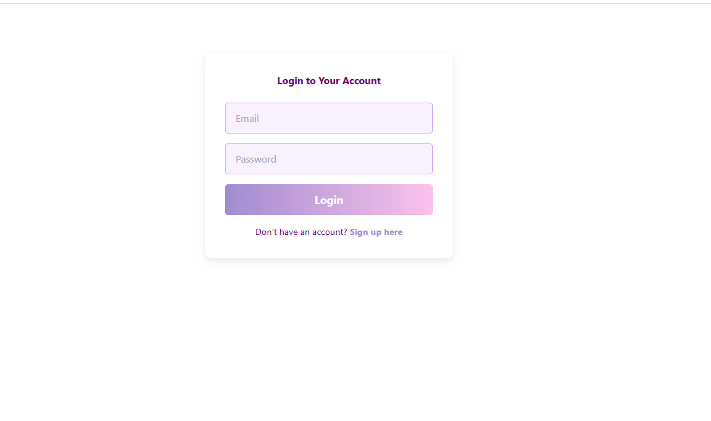
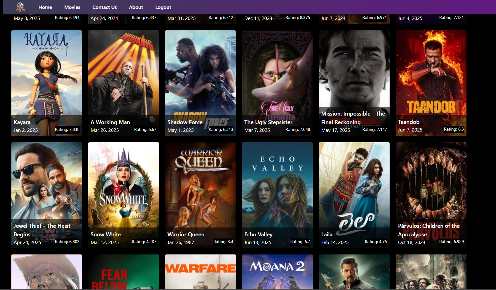

# 🍿 WatchApp

**WatchApp** is a full-stack web application for browsing movies with user authentication and dynamic data fetched from an external movie API. Built with Angular on the frontend and Node.js/Express on the backend, it also integrates MongoDB for user data storage.

---

## 🖼️ Screenshots

### 🔐 Login Page

### 🎬 Movie List

## 🚀 Features

- 🔐 **User Authentication** (Sign up / Login)
- 🎬 **Dynamic Movie Listing** via an external API
- 📦 **RESTful Backend API** with Express
- 💾 **MongoDB** for storing user credentials and data
- 📱 **Responsive UI** built with Angular

---

## 🛠️ Technologies Used

### Frontend:
- **Angular**
- **TypeScript**
- **HTML / CSS**

### Backend:
- **Node.js**
- **Express.js**

### Database:
- **MongoDB** (with Mongoose)

### External APIs:
- 🎞️ Movie data fetched from an external API ,  TMDB 

---

## 📁 Project Structure
watchapp/
├──Frontend/ # Angular Frontend
│ ├── src/
│ └── ...
├── signup-backend/ # Node.js Backend
│ ├── routes/
│ ├── models/
│ └── ...
└── README.md

### Setup Backend :
cd server
npm install
npm start

### Setup Frontend :
cd ../client
npm install
ng serve

✍️ Author
Saba Zeibi
